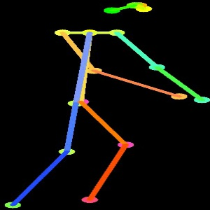
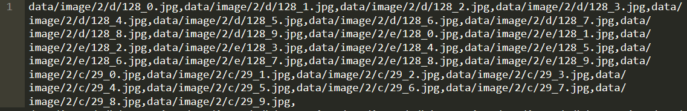

#Dance scoring algorithm base on 3D-Resnet network

##1.The method of extracting key points
I deal with Alphapose algorithm£¬all code or weight are integrated to two files and one floder.  
aphapose_script  
alphapose_opt  
alphapose_weight  

The alphapose_script main function can enter a video or a image. Returns the body key points and node diagrams.You need to know opencv to change the code. You can customize the main function to your own needs, as a module and migrate it to your own code for use alone.  
If you want to try it,the fllowing code is ok.  

<code>
python alphapose_script.py  
</code>

node diagrams is shown:  

##2.Construct dataset  
Next you need to build the training data set. The data is placed in the "data" folder.  
/data  
&nbsp;&nbsp;/txt  
&nbsp;&nbsp;&nbsp;&nbsp;train.txt  
&nbsp;&nbsp;&nbsp;&nbsp;validation.txt  
&nbsp;&nbsp;&nbsp;&nbsp;test.txt  
&nbsp;&nbsp;/image  
&nbsp;&nbsp;&nbsp;&nbsp;/1  
&nbsp;&nbsp;&nbsp;&nbsp;&nbsp;&nbsp;/a  
&nbsp;&nbsp;&nbsp;&nbsp;&nbsp;&nbsp;&nbsp;&nbsp;0_0.jpg  
...  
&nbsp;&nbsp;&nbsp;&nbsp;&nbsp;&nbsp;/b  
&nbsp;&nbsp;&nbsp;&nbsp;&nbsp;&nbsp;&nbsp;&nbsp;0_0.jpg  
...  
&nbsp;&nbsp;&nbsp;&nbsp;/2  
.......  
The three ".txt" files under "txt" floder are training, verification, testing triples.  
One line of each ".txt" is the position of 3*10 pictures, respectively 10 pictures of A, P and N.  
  
In the folder "image", there are 1-11 folders containing 28 individual dance node diagrams, which are saved in folders "a-z", "aa" and "bb".    

##3.Train network
###3.1 he meaning of each file
*opt.py*&nbsp;&nbsp;&nbsp;&nbsp;This file is used to set the training superparameters. The meaning of the specific superparameters is explained in the file.  
*main.py*&nbsp;&nbsp;&nbsp;&nbsp;The main function of training or testing.  
*model.py*&nbsp;&nbsp;&nbsp;&nbsp; Network,Specific network modules are available in the models folder.  
*epoch_op.py*&nbsp;&nbsp;&nbsp;&nbsp;Specific steps of the training process.  
*dataset.py*&nbsp;&nbsp;&nbsp;&nbsp;Defines how data is generated.  
*visualize.py*&nbsp;&nbsp;&nbsp;&nbsp;Visual process.  
###3.2 Training or testing
Change opt.py  
start visdom  
<code>python -m visdom.server  
</code>
Open another terminal  
<code>python main.py  
</code>

